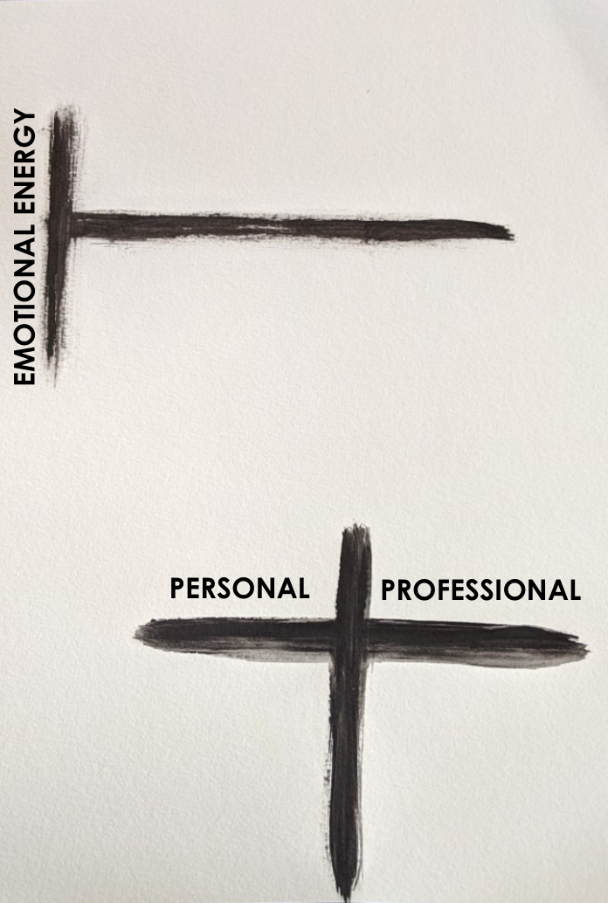
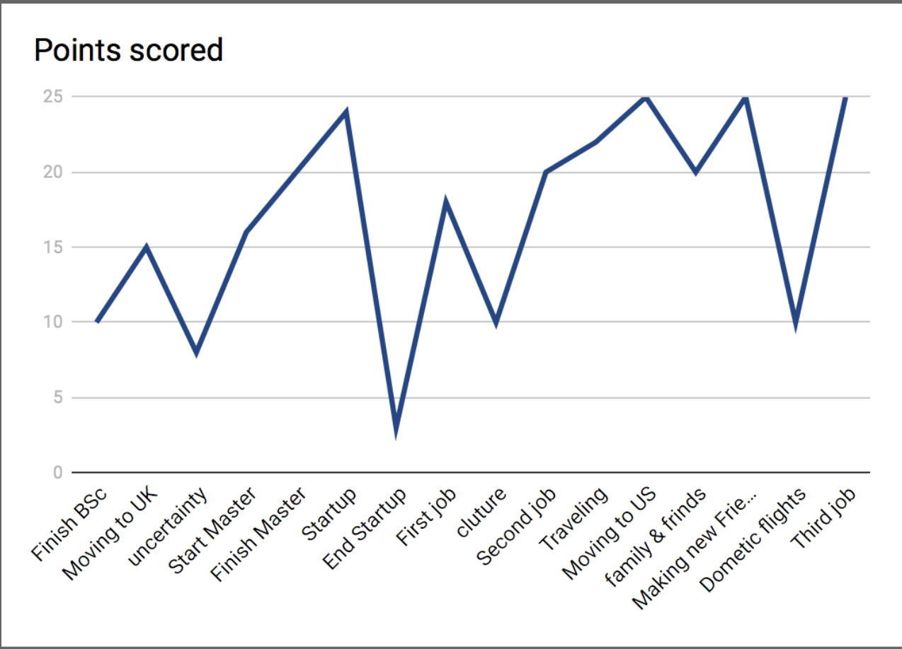

# Journey Lines – A Team Building Activity

Each of the participants:

- Reflect back on the personal & professional moments
- Both the ups and the downs
- X axis which represents time
- Y axis that represents emotional high & low points

Journey line is a about creating high performance team, high performing team is base on trust.

The idea is high performing teams occur when a group of individuals is willing to be vulnerable, establish trust and work together in support of a goal that is more important than their individual accomplishments

The opportunity as a leader is to break down the invisible walls that each of us has created individually, and forge the personal bonds and shared humanity that will bring individuals together as an “All Star Team.”

